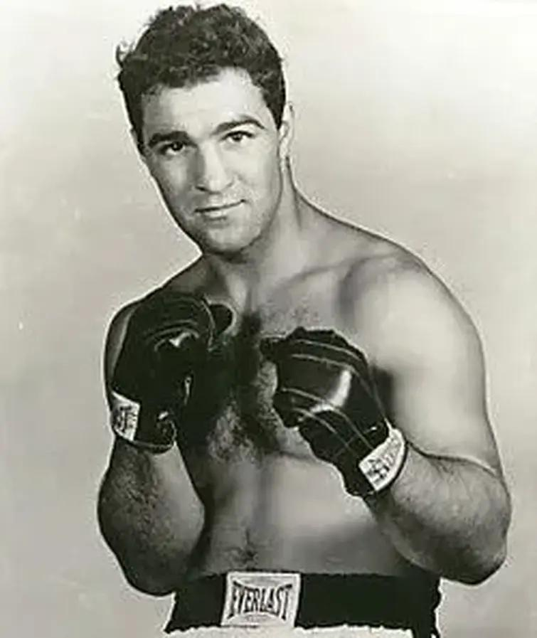
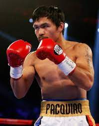
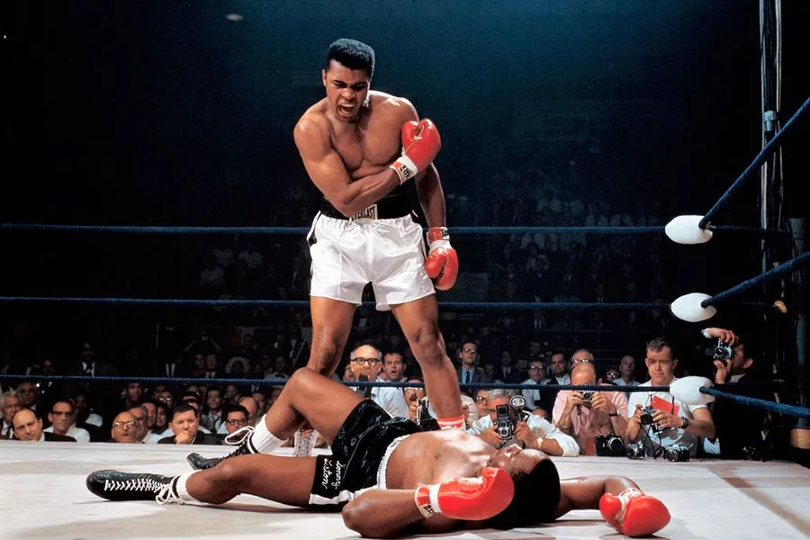

[index.html](https://github.com/user-attachments/files/23574681/index.html)
<!DOCTYPE html>
<html lang="es">
<head>
  <meta charset="utf-8" />
  <meta name="viewport" content="width=device-width, initial-scale=1" />
  <title>El Mundo del Boxeo</title>
  
</head>
<body>
  <header>
    <h1>El Mundo del Boxeo</h1>
    
Fuerza • Estrategia • Honor • Disciplina

  </header>

  <nav>
    <a href="#caracteristicas">Características</a>
    <a href="#reglas">Reglas</a>
    <a href="#beneficios">Beneficios</a>
    <a href="#peligros">Peligros</a>
    <a href="#movimientos">Movimientos</a>
    <a href="#equipo">Equipo</a>
    <a href="#torneos">Torneos</a>
    <a href="#boxeadores">Famosos</a>
  </nav>

  <main>
    <section id="caracteristicas">
      <h2>Características del boxeo</h2>
      

        El boxeo es un deporte de combate que combina fuerza, velocidad, resistencia y técnica. Dos oponentes se enfrentan en un ring, utilizando únicamente los puños protegidos por guantes para golpear dentro de las reglas establecidas.
        Más allá de ser una disciplina física, el boxeo es una ciencia de estrategia, donde el control mental y la lectura del rival son esenciales.
      

      

        Existen distintas categorías de peso que garantizan enfrentamientos justos, desde peso mosca hasta peso pesado. Cada categoría tiene su propio prestigio y campeonatos mundiales reconocidos.
      

    </section>

    <section id="reglas">
      <h2>Reglas principales</h2>
      <ul>
        <li>Los combates se dividen en asaltos o “rounds” de 3 minutos, con 1 minuto de descanso entre cada uno.</li>
        <li>Está prohibido golpear por debajo del cinturón, en la nuca o después del toque de campana.</li>
        <li>Solo se permite el uso de los puños: los codos, rodillas o cabezazos implican sanción.</li>
        <li>El árbitro puede detener la pelea si un boxeador no se defiende adecuadamente o está en peligro.</li>
        <li>Los jueces otorgan puntos por la precisión, defensa y dominio general del combate.</li>
      </ul>
    </section>

    <section id="beneficios">
      <h2>Beneficios del boxeo</h2>
      

        Practicar boxeo no solo fortalece el cuerpo, también desarrolla la mente y el carácter. Es una excelente herramienta para liberar estrés, mejorar la concentración y fomentar la disciplina.
      

      <ul>
        <li>Incrementa la resistencia cardiovascular y la fuerza muscular.</li>
        <li>Mejora los reflejos, el equilibrio y la coordinación.</li>
        <li>Reduce el estrés gracias a la liberación de endorfinas durante el entrenamiento.</li>
        <li>Enseña autocontrol, respeto por el oponente y perseverancia.</li>
      </ul>
    </section>

    <section id="peligros">
      <h2>Riesgos del boxeo</h2>
      

        Como todo deporte de contacto, el boxeo presenta riesgos si no se practica correctamente. Entre los más comunes están los hematomas, las lesiones articulares o, en casos extremos, las conmociones cerebrales.
      

      

        Por ello es vital entrenar bajo supervisión profesional, usar equipo adecuado y respetar los descansos entre sesiones. La seguridad siempre debe ser prioridad.
      

    </section>

    <section id="movimientos">
      <h2>Movimientos y golpes básicos</h2>
      <ul>
        <li><strong>Jab:</strong> golpe rápido con la mano adelantada, ideal para medir distancia o iniciar combinaciones.</li>
        <li><strong>Cross:</strong> golpe directo con la mano trasera, más potente que el jab.</li>
        <li><strong>Hook (gancho):</strong> golpe circular que impacta de lado, generalmente a la mandíbula o costillas.</li>
        <li><strong>Uppercut:</strong> golpe ascendente dirigido al mentón del rival.</li>
        <li><strong>Esquiva:</strong> movimiento defensivo que permite evitar el impacto y contraatacar.</li>
      </ul>
    </section>

    <section id="equipo">
      <h2>Equipo necesario para practicar boxeo</h2>
      <ul>
        <li><strong>Guantes:</strong> de 8 a 16 onzas, según el peso y la categoría.</li>
        <li><strong>Vendas:</strong> protegen los nudillos y articulaciones de la mano.</li>
        <li><strong>Casco protector:</strong> usado en entrenamientos o categorías amateur.</li>
        <li><strong>Protector bucal e inguinal:</strong> indispensables para la seguridad.</li>
        <li><strong>Zapatillas ligeras:</strong> permiten agilidad y buen desplazamiento en el ring.</li>
        <li><strong>Saco de boxeo y manoplas:</strong> usados para mejorar técnica, precisión y potencia.</li>
      </ul>
    </section>

    <section id="torneos">
      <h2>Torneos y competencias más importantes</h2>
      

        A lo largo del año se celebran múltiples torneos profesionales y amateur que definen la élite del boxeo mundial. Entre los más destacados están:
      

      <ul>
        <li><strong>Campeonatos Mundiales (WBC, WBA, IBF, WBO):</strong> las cuatro grandes organizaciones que otorgan títulos mundiales oficiales.</li>
        <li><strong>Golden Gloves:</strong> torneo estadounidense de gran prestigio para boxeadores amateurs.</li>
        <li><strong>Juegos Olímpicos:</strong> máxima competencia amateur donde nacen futuras leyendas.</li>
        <li><strong>World Boxing Super Series (WBSS):</strong> torneo internacional que enfrenta a campeones de distintas asociaciones.</li>
        <li><strong>Campeonato Mundial Femenino:</strong> cada vez con mayor relevancia y figuras destacadas como Katie Taylor o Amanda Serrano.</li>
      </ul>
    </section>

    <section id="boxeadores">
      <h2>Boxeadores más famosos</h2>
      

        

          
          
Rocky Marciano

          
Campeón invicto de peso pesado con un récord de 49 victorias, 43 por nocaut. Su determinación y estilo agresivo lo convirtieron en una leyenda del siglo XX.

        

        

          
          
Mike Tyson

          
Conocido como “Iron Mike”, fue el campeón más joven de peso pesado de la historia, famoso por su potencia devastadora y ferocidad en el ring.

        

        

          
          
Floyd Mayweather Jr.

          
Invicto con récord de 50-0, maestro de la defensa y estrategia. Su estilo técnico lo consolidó como uno de los mejores boxeadores de todos los tiempos.

        

        

          
          
Manny Pacquiao

          
Único boxeador campeón mundial en ocho divisiones. Ídolo de Filipinas, combinó velocidad, precisión y una carrera política inspiradora.

        

        

          
          
Julio César Chávez

          
Leyenda mexicana con más de 100 victorias. Su resistencia, coraje y estilo ofensivo lo convirtieron en uno de los más queridos del boxeo latinoamericano.

        

        

          
          
Muhammad Ali

          
Apodado “The Greatest”, fue un ícono mundial por su habilidad, carisma y activismo social. Tres veces campeón mundial de peso pesado.

        

      

    </section>
  </main>

  <button id="topBtn" title="Ir arriba">↑</button>
  <footer>&copy; 2025 El Mundo del Boxeo — Todos los derechos reservados.</footer>

  
</body>
</html>
